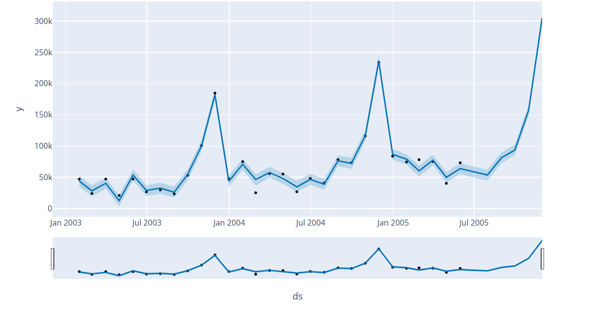
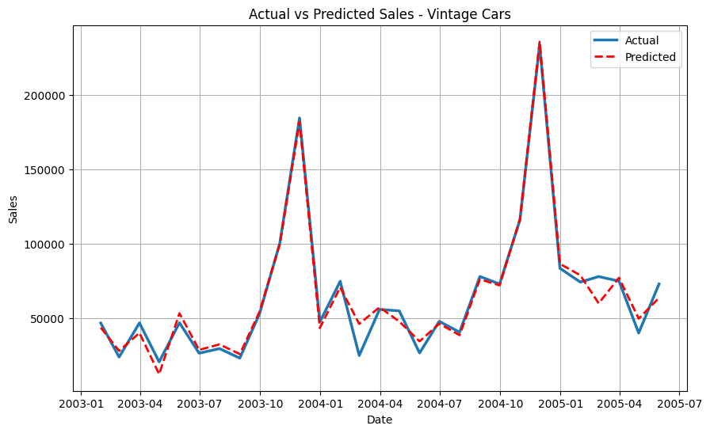

📊 Task 1 – Sales Forecasting with Prophet

I built a time series forecasting model using sales data and the Prophet library to predict future sales as the first task of my **Future Interns**  Machine Learning Internship.

📦 Datasets Used
- [Kaggle: Sample Sales Data](https://www.kaggle.com/datasets/kyanyoga/sample-sales-data)

🔍 Project Objective
To forecast monthly sales for the product line **Vintage Cars** using Prophet with multiplicative seasonality.

🛠 Tools Used

- Python
- Pandas 
- Seaborn
- Matplotlib
- Prophet 
- Kaggle
- Scikit-learn

 🔢 Model Evaluation
| Metric | Value |
|--------|--------|
| MAE | 4905.56 |
| RMSE | 6852.82 |
| MAPE | 12.23% |

---

📈 Forecast Insights

- 🔍 **Peak Month**: November 2005  
- 💰 **Predicted Peak Sales**: $304804.14
- 📈 **Year-over-Year Sales Growth**: 44.27%

---

📸 Visualizations

# 1. Forecast Plot  

# 2. Actual vs Predicted Comparison  

---
 💡 Business Use Case

This forecasting solution helps businesses:
- Anticipate product demand
- Plan inventory ahead of peak months
- Align promotions with seasonality

---

## 🔗 Useful Links

- 📘 [Kaggle Notebook](https://www.kaggle.com/code/pruthvirajsinhzala99/sales-prediction)
- 📣 [LinkedIn Post](https://www.linkedin.com/posts/pruthvirajsinh-zala_futureinterns-internship-salesforecasting-activity-7325036569084481536-INE_?utm_source=share&utm_medium=member_desktop&rcm=ACoAAEUFPK0BQ9rBAH43xcdD_uyV5Tfe-M7-2Yw)

---